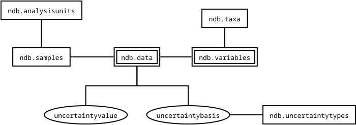

# Adding Uncertainty to Neotoma

The use of uncertainty is critical. We need it directly associated with individual measurements, and we need to identify the type of uncertainty.

## Table modifications

The table `ndb.data` needs two new columns: `uncertaintyvalue` and `uncertaintytype`.

They will inherit information from the `ndb.variables` row, so the assumption is that the uncertainty is reported in the same units (and for the same taxon) as the `ndb.data.value`. 



### Proposed `ndb.uncertaintybases` structure

| uncertaintybasisid | uncertaintybasis | . . . |

```SQL
CREATE TABLE IF NOT EXISTS ndb.uncertaintybases (
    uncertaintybasisid SERIAL PRIMARY KEY,
    uncertaintybasis text,
    CONSTRAINT uniquebasis UNIQUE (uncertaintybasis)
);
```

#### Proposed `ndb.uncertaintybasis.uncertaintybasis` values:

Proposed values for uncertainty tables will come from standard reporting of uncertainty.

* 1 Standard Deviation
* 2 Standard Deviations
* 3 Standard Deviations
* Mean square error

```SQL
INSERT INTO ndb.uncertaintybases (uncertaintybasis)
VALUES ('1 Standard Deviation'),
       ('2 Standard Deviations'),
       ('3 Standard Deviation'),
       ('1 Standard Error');
```

### Proposed `ndb.data` structure

Modifying the table using the new `ndb.uncertaintybases` table then allows us to link uncertainties.

| dataid | sampleid | variableid | value | uncertaintyvalue | uncertaintybasisid | . . . |

```sql
ALTER TABLE ndb.data
ADD COLUMN IF NOT EXISTS uncertaintyvalue NUMERIC,
ADD COLUMN IF NOT EXISTS uncertaintybasisid INT,
ADD CONSTRAINT uncert_fk FOREIGN KEY(uncertbasisid) REFERENCES ndb.uncertaintybases(uncertaintybasisid);
```

